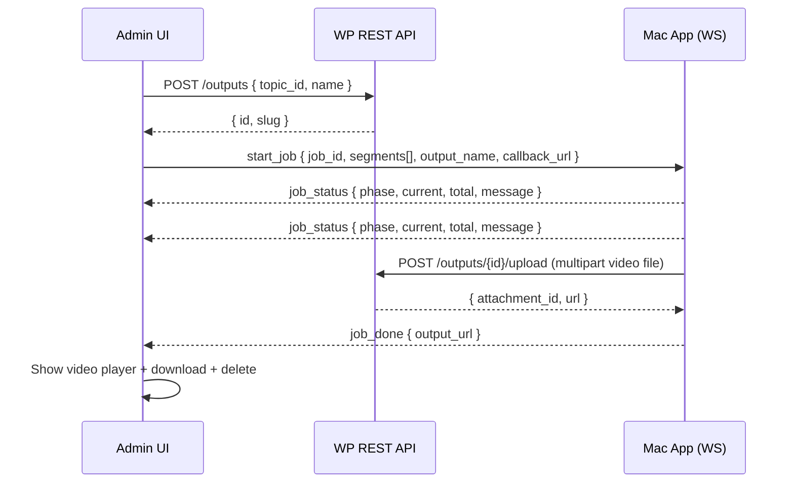

# Muxing WebSocket Integration (PoC)

## Overview

The muxing system allows site owners to combine a topic's intro video and approved reply clips into a single "Clipisode" output video. The admin UI connects to a local Mac app via WebSocket, sends it the source video URLs, and receives real-time progress updates. The Mac app downloads the source files, muxes them, and POSTs the result back to a WordPress REST endpoint. Multiple outputs per topic are supported.

## Flow



## WebSocket Protocol

Server: `ws://127.0.0.1:63481`

Connection is initiated only when the user clicks "Generate Clipisode". The admin sends `hello`, waits for `hello_ack`, then sends `start_job`.

### Messages: Client → Mac App

| type | fields | description |
|---|---|---|
| `hello` | `client`, `version` | Handshake |
| `start_job` | `job_id`, `output_name`, `callback_url`, `segments[]` | Start muxing |
| `cancel_job` | `job_id` | Cancel in-progress job |

### Messages: Mac App → Client

| type | fields | description |
|---|---|---|
| `hello_ack` | | Handshake response |
| `job_status` | `job_id`, `phase`, `current`, `total`, `message` | Progress update |
| `job_done` | `job_id`, `output_url` | Muxing complete, URL is from WP upload response |
| `job_error` | `job_id`, `code`, `message` | Muxing failed |
| `job_cancelled` | `job_id` | Cancellation confirmed |
| `connection_rejected` | `reason` | Connection refused |

### Phases

`downloading` → `trimming` → `joining` → done

## Payload Example

```json
{
  "type": "start_job",
  "job_id": "20260218T063000Z",
  "output_name": "peyton-and-i-need-your-help-all.mp4",
  "callback_url": "https://mcp.local/wp-json/clipisode/v1/outputs/42/upload",
  "segments": [
    { "url": "https://mcp.local/wp-content/uploads/intro.mp4", "order": 1 },
    { "url": "https://mcp.local/wp-content/uploads/clip1.mp4", "order": 2 },
    { "url": "https://mcp.local/wp-content/uploads/clip2.mp4", "order": 3 }
  ]
}
```

- `output_name`: `<topic-title-slug>-all.mp4` — used as the filename for the muxed video
- `callback_url`: WP REST endpoint with the output row ID, where the Mac app POSTs the final video
- `segments`: intro video first (if present), then approved clips in creation order

## Database: `wp_clipisode_outputs`

| Column | Type | Notes |
|---|---|---|
| `id` | BIGINT UNSIGNED AUTO_INCREMENT | PK |
| `topic_id` | BIGINT UNSIGNED NULLABLE | NULL for future cross-topic outputs (highlight reels) |
| `name` | VARCHAR(255) | Display name, e.g. "All Clips", "Highlight Reel" |
| `slug` | VARCHAR(255) UNIQUE | URL/file-safe identifier, auto-incremented on conflict (highlight-reel, highlight-reel-1) |
| `attachment_id` | BIGINT UNSIGNED NULLABLE | WP media library ID, NULL until muxing completes |
| `created_at` | DATETIME | |

The slug is globally unique and doubles as the download filename (`{slug}.mp4`). The output row is created before the WS job starts so the callback URL has an ID. If muxing fails, the row remains with `attachment_id = NULL`.

## REST Endpoints

| Method | Endpoint | Auth | Description |
|---|---|---|---|
| POST | `/clipisode/v1/outputs` | `manage_options` | Create output row. Accepts `topic_id` (nullable), `name`. Returns `{ id, name, slug }`. |
| POST | `/clipisode/v1/outputs/{id}/upload` | None (POC) | Receives multipart `video` file from Mac app. Saves to media library, updates `attachment_id`. Returns `{ attachment_id, url }`. |
| DELETE | `/clipisode/v1/outputs/{id}` | `manage_options` | Deletes output row and its media library attachment. |

Outputs are also included in the topic response via `enrich_topic()` as `outputs[]` with `id`, `name`, `slug`, `url`, `created_at`.

## Admin UI States

The "Clipisode" section appears on the Topic Detail page below Clips.

| State | What's shown |
|---|---|
| **Idle** | Existing outputs (video player, download, delete each). "Generate Clipisode" button (disabled if no approved clips). Each generate creates a new output. |
| **Connecting** | Spinner + "Connecting to muxing service..." |
| **Processing** | Phase label, progress message, progress bar, cancel button |
| **Done** | Video player with the uploaded URL + download + delete |
| **Error** | Error message + retry button |

## Test Server

`tools/websocket/echo.py` — Interactive WebSocket server for testing without the real Mac app.

```bash
python3 tools/websocket/echo.py
```

Commands after a job is received:
- `s <phase> <current> <total> [message]` — send job_status
- `d [file_path]` — upload video to WP callback + send job_done (generates dummy MP4 if no path)
- `e [message]` — send job_error
- `c` — send job_cancelled
- `r` — send raw JSON
- `q` — quit

## Files

| File | What it does |
|---|---|
| `includes/class-database.php` | `wp_clipisode_outputs` table creation |
| `includes/class-rest-api.php` | Output CRUD endpoints, upload endpoint, `enrich_topic()` outputs |
| `src/types.ts` | `Output` interface, `Topic.outputs` |
| `src/pages/TopicDetail.tsx` | Generate Clipisode UI + WebSocket logic |
| `src/index.scss` | Muxing section styles |
