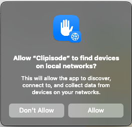

# Clipisode Transcoding

Video transcoding services that composite clipisode videos from source media.

## Implementations

- `macos/` — Native macOS app. Runs a local WebSocket server on port 63481, receives render requests from the WordPress admin, and uploads finished videos back via callback URL.
- `web/` — Browser-based transcoding prototype.
- `web-wasm/` — WASM-based transcoding prototype.
- `docs/` — Transcoding-specific documentation.

## macOS Setup

On first launch, macOS will prompt you to allow local network access. Click **Allow** — the app needs this to accept WebSocket connections from the browser on `127.0.0.1`.

